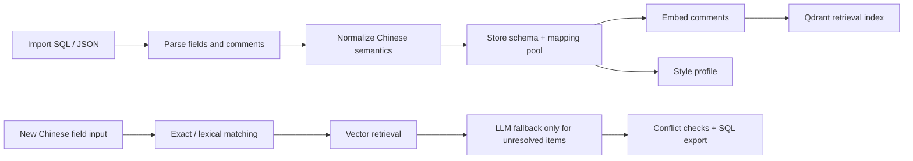

# Semantic Field Namer

[中文文档](README.zh-CN.md)

Semantic Field Namer is a schema naming tool for teams that work with Chinese table comments and need consistent English field names.

It imports existing schemas, builds a reusable project-level mapping pool, extracts naming style, and generates new field names by combining:

- exact semantic reuse
- lexical similarity matching
- vector retrieval with Qdrant
- LLM fallback through an OpenAI-compatible gateway

The product is designed for internal data modeling, data governance, and structured delivery workflows where naming consistency matters more than one-off translation.

## Status

Beta. The project is usable and tested for local development, but still evolving toward a stronger open-source release shape.

## What it does

- Import SQL DDL or JSON schema metadata
- Parse Chinese comments and existing English field names
- Build a project-local semantic mapping pool
- Summarize naming style and abbreviation habits
- Generate new field names from Chinese input
- Explain where each generated field came from
- Export PostgreSQL-style `CREATE TABLE` statements
- Support per-project collaboration and sharing

## Core workflow



## Repository layout

```text
semantic-field-namer/
  backend/      FastAPI app, SQLite models, import/generation services
  frontend/     React + Vite application
  examples/     Sample SQL, JSON, and output assets
  docs/         Architecture and roadmap
  scripts/      Local helper scripts
```

## Quick start

There are two supported ways to run the project:

- Docker one-command startup
- Local development startup

### Option A — Docker one-command startup

```powershell
docker compose up --build
```

Then open:

- Frontend: `http://127.0.0.1:8080`
- Backend: `http://127.0.0.1:8000`
- Qdrant: `http://127.0.0.1:6333`

If you want LLM fallback inside Docker, copy `compose.env.example` to `.env` in the repository root and fill in the OpenAI-compatible gateway variables before running `docker compose up --build`.

### Option B — Local development startup

Run backend, frontend, and Qdrant separately.

#### 1. Backend

```powershell
cd backend
Copy-Item .env.example .env
python -m pip install -r requirements.txt
python -m uvicorn app.main:app --reload --port 8000
```

#### 2. Frontend

```powershell
cd frontend
Copy-Item .env.example .env
npm install
npm run dev
```

#### 3. Qdrant

```powershell
docker compose up -d
```

#### 4. Open the app

- Frontend: `http://127.0.0.1:5173`
- Backend: `http://127.0.0.1:8000`
- AI health: `http://127.0.0.1:8000/api/system/ai-health`

## Environment variables

### Backend

See [backend/.env.example](backend/.env.example).

Important variables:

- `DATABASE_URL`
- `QDRANT_URL`
- `OPENAI_API_KEY`
- `OPENAI_BASE_URL`
- `OPENAI_MODEL`

The default model value is `gpt-5.4`, but deployment should treat it as configurable rather than guaranteed.

### Frontend

See [frontend/.env.example](frontend/.env.example).

## Examples

See the [examples](examples) directory for:

- SQL import sample
- JSON import sample
- Generation input sample
- Generated PostgreSQL SQL output sample
- Full showcase case: [land_direct_supply_showcase](examples/land_direct_supply_showcase)

## API surface

Main routes:

- `POST /api/auth/register`
- `POST /api/auth/login`
- `GET /api/system/ai-health`
- `POST /api/projects/{project_id}/imports/sql`
- `POST /api/projects/{project_id}/imports/json`
- `GET /api/projects/{project_id}/imports/fields`
- `POST /api/projects/{project_id}/style/analyze`
- `GET /api/projects/{project_id}/style/profile`
- `POST /api/projects/{project_id}/fields/generate`
- `POST /api/projects/{project_id}/mappings/confirm`

## Validation

Verified locally:

- `python -m compileall app tests`
- `python -m pytest -q`
- `npm run build`

## Release readiness gaps

The project is now structured for open-source release, but the roadmap still includes:

- better mapping pool management UI
- stronger import quality diagnostics
- richer SQL dialect controls
- cleaner React/Ant Design compatibility story

See [docs/ROADMAP.md](docs/ROADMAP.md).
