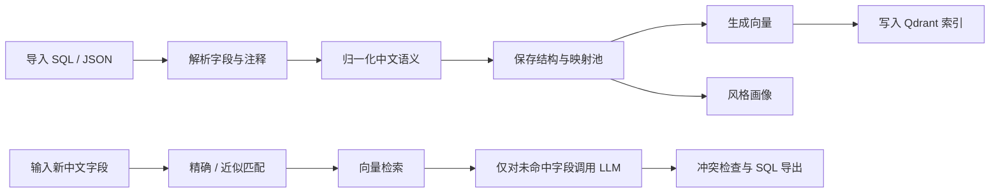

# Semantic Field Namer

[English](README.md)

Semantic Field Namer 是一个面向中文表结构注释场景的字段命名工具，用来帮助团队在已有命名风格基础上持续生成一致的英文字段名。

它会导入现有表结构，沉淀项目级语义映射池，提取命名风格，并结合以下几种机制生成新字段名：

- 本地精确命中
- 近似匹配
- Qdrant 向量检索
- OpenAI 兼容网关的大模型兜底

这个项目适合：

- 数据建模
- 数据治理
- 数仓字段标准化
- 政企系统字段命名统一

## 当前状态

Beta。当前版本已经可用于本地开发和内部工具场景，也具备开源发布所需的基础结构。

## 主要能力

- 导入 SQL DDL 或 JSON 结构元数据
- 解析中文注释和英文字段名
- 构建项目级语义映射池
- 分析命名风格和缩写习惯
- 根据中文输入批量生成英文字段名
- 展示命中来源和解释
- 导出 PostgreSQL 风格 `CREATE TABLE` 语句
- 支持项目协作与共享

## 核心流程



## 仓库结构

```text
semantic-field-namer/
  backend/      FastAPI 后端、SQLite 模型、导入/生成服务
  frontend/     React + Vite 前端
  examples/     示例 SQL、JSON、导出结果和展示案例
  docs/         架构说明与路线图
  scripts/      本地开发辅助脚本
```

## 快速启动

### 一条命令启动

```powershell
docker compose up --build
```

启动后访问：

- 前端：`http://127.0.0.1:8080`
- 后端：`http://127.0.0.1:8000`
- Qdrant：`http://127.0.0.1:6333`

如果你希望 Docker 环境里也启用大模型兜底能力，请先把仓库根目录下的 `compose.env.example` 复制成 `.env`，再填入 OpenAI 兼容网关相关变量，然后执行 `docker compose up --build`。

### 1. 启动后端

```powershell
cd backend
Copy-Item .env.example .env
python -m pip install -r requirements.txt
python -m uvicorn app.main:app --reload --port 8000
```

### 2. 启动前端

```powershell
cd frontend
Copy-Item .env.example .env
npm install
npm run dev
```

### 3. 启动 Qdrant

```powershell
docker compose up -d
```

### 4. 打开页面

- 前端：`http://127.0.0.1:5173`
- 后端：`http://127.0.0.1:8000`
- AI 健康检查：`http://127.0.0.1:8000/api/system/ai-health`

## 环境变量

### 后端

参考 [backend/.env.example](backend/.env.example)

关键变量：

- `DATABASE_URL`
- `QDRANT_URL`
- `OPENAI_API_KEY`
- `OPENAI_BASE_URL`
- `OPENAI_MODEL`

默认模型值是 `gpt-5.4`，但实际部署时应视为可配置项，而不是固定保证可用的模型名。

### 前端

参考 [frontend/.env.example](frontend/.env.example)

## 示例

查看 [examples](examples) 目录：

- SQL 导入样例
- JSON 导入样例
- 字段生成输入样例
- PostgreSQL 导出样例
- 完整展示案例：[land_direct_supply_showcase](examples/land_direct_supply_showcase)

## 主要接口

- `POST /api/auth/register`
- `POST /api/auth/login`
- `GET /api/system/ai-health`
- `GET /api/system/ai-sources`
- `POST /api/projects/{project_id}/imports/sql`
- `POST /api/projects/{project_id}/imports/json`
- `POST /api/projects/{project_id}/imports/excel`
- `POST /api/projects/{project_id}/imports/txt`
- `GET /api/projects/{project_id}/imports/fields`
- `PUT /api/projects/{project_id}/imports/fields/{field_id}`
- `POST /api/projects/{project_id}/style/analyze-task`
- `PUT /api/projects/{project_id}/style/thresholds`
- `POST /api/projects/{project_id}/fields/generate-task`
- `POST /api/projects/{project_id}/mappings/confirm`

## 已验证

本地已验证：

- `python -m compileall app tests`
- `python -m pytest -q`
- `npm run build`

## 后续路线

虽然当前已经具备开源仓库所需的基础结构，但后续还会继续增强：

- 更完整的映射池管理界面
- 更强的导入质量诊断
- 更丰富的 SQL 方言导出能力
- 更稳的 React / Ant Design 兼容策略

详见 [docs/ROADMAP.md](docs/ROADMAP.md)
